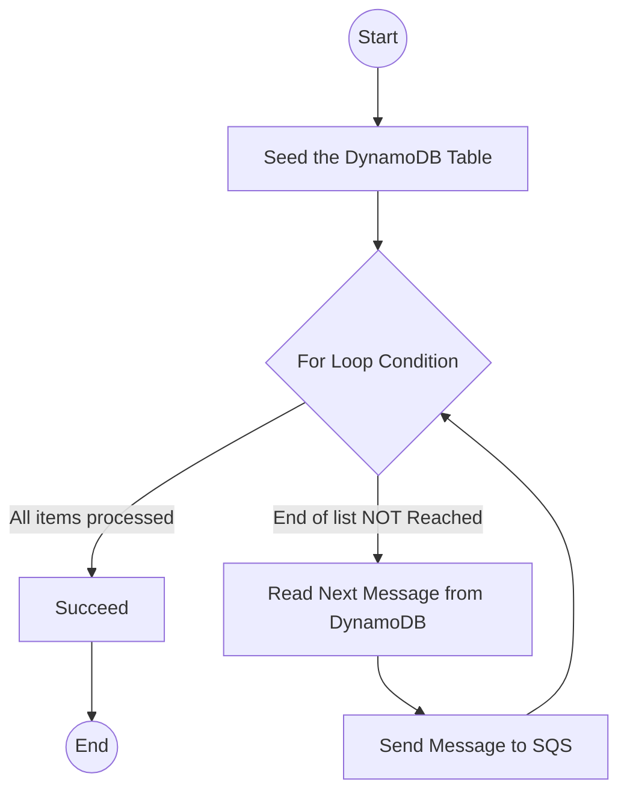
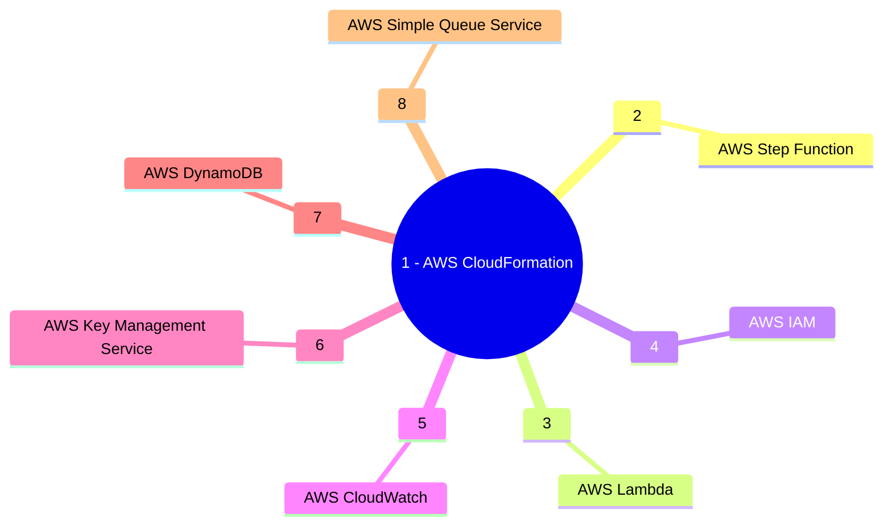

&nbsp;&nbsp;&nbsp;&nbsp;&nbsp;&nbsp;&nbsp;&nbsp;&nbsp;


# Project Celosia: Transfer Data Records (Lambda, DynamoDB, Amazon SQS)

This is a demo Step Function workflow, which demonstrates transfer of data from a DynamoDB to SQS iteratively.

## Description

This sample project demonstrates how to iteratively read items from an Amazon DynamoDB table and send these items to an Amazon SQS queue using a Step Functions state machine. Deploying this sample project will create a Step Functions state machine, a DynamoDB table, an AWS Lambda function, and an Amazon SQS queue.

In this project, Step Functions uses the Lambda function to populate the DynamoDB table. The state machine also uses a for loop to read each of the entries, and then sends each entry to an Amazon SQS queue.



### Services Used


### Getting Started

* This repository is configured to deploy the stack in Development, Staging and Production AWS Accounts. To use the pipeline you need to have 
three AWS Accounts created in an AWS Org under a Management Account (which is the best practice). The Org structure will be as follows:

```
Root
├─ Management
├─ Development
├─ Test
└─ Production
```

* Create KMS Key in each of the AWS Accounts which will be used to encrypt the resources.

* Create an OpenID Connect Identity Provider

* Create an IAM Role for OIDC and use the sample Trust Policy in each of the three AWS accounts
```
{
    "Version": "2008-10-17",
    "Statement": [
        {
            "Effect": "Allow",
            "Principal": {
                "Federated": "arn:aws:iam::<Account Id>:oidc-provider/token.actions.githubusercontent.com"
            },
            "Action": "sts:AssumeRoleWithWebIdentity",
            "Condition": {
                "StringLike": {
                    "token.actions.githubusercontent.com:sub": [
                        "repo:<GitHub User>/<GitHub Repository>:ref:refs/head/main",
                    ]
                }
            }
        }
    ]
}
```

  * Create an IAM Policy to allow CloudFormation access and attach it to the OIDC Role, using the sample policy document:
```
{
    "Version": "2012-10-17",
    "Statement": [
        {
            "Sid": "VisualEditor0",
            "Effect": "Allow",
            "Action": [
                "cloudformation:CreateStack",
                "cloudformation:DeleteStack",
                "cloudformation:CreateChangeSet",
                "cloudformation:DescribeChangeSet",
                "cloudformation:ExecuteChangeSet",
                "cloudformation:DeleteChangeSet",
                "cloudformation:DescribeStacks",
                "cloudformation:DescribeStackEvents",
                "iam:getRolePolicy"
            ],
            "Resource": "*"
        },
        {
            "Sid": "VisualEditor1",
            "Effect": "Allow",
            "Action": "kms:CreateGrant",
            "Resource": "arn:aws:kms:us-east-1:237376087602:key/f7eb118d-f1d2-4d70-a046-dfada470840e"
        }
    ]
}
```

  * Create an IAM Policy to allow creation and deletion of resources  and attach it to the OIDC Role, using the following sample policy document:
```
{
    "Version": "2012-10-17",
    "Statement": [
        {
            "Sid": "AllowS3Access",
            "Effect": "Allow",
            "Action": [
                "s3:PutObject",
                "s3:GetObject",
                "s3:CreateBucket",
                "s3:PutObjectTagging",
                "s3:PutBucketPublicAccessBlock",
                "s3:PutBucketAcl",
                "s3:DeleteObject",
                "s3:DeleteBucket",
                "s3:ListBucket",
                "s3:PutBucketTagging",
                "s3:GetBucketTagging",
                "s3:GetBucketPolicy",
                "s3:GetBucketAcl",
                "s3:GetObjectAcl",
                "s3:GetObjectVersionAcl",
                "s3:PutObjectAcl",
                "s3:PutObjectVersionAcl",
                "s3:GetBucketCORS",
                "s3:PutBucketCORS",
                "s3:GetBucketWebsite",
                "s3:GetBucketVersioning",
                "s3:GetAccelerateConfiguration",
                "s3:GetBucketRequestPayment",
                "s3:GetBucketLogging",
                "s3:GetLifecycleConfiguration",
                "s3:GetReplicationConfiguration",
                "s3:GetEncryptionConfiguration",
                "s3:GetBucketObjectLockConfiguration",
                "s3:GetBucketOwnershipControls",
                "s3:GetObjectTagging",
                "s3:GetBucketNotification",
                "s3:PutEncryptionConfiguration",
                "s3:PutBucketOwnershipControls",
                "s3:PutBucketNotification",
                "s3:ListBucketVersions",
                "s3:PutObjectTagging",
                "s3:PutBucketVersioning"
            ],
            "Resource": "*"
        },
        {
            "Sid": "IAMAccess",
            "Effect": "Allow",
            "Action": [
                "iam:GetRole",
                "iam:CreateRole",
                "iam:DeleteRolePolicy",
                "iam:PutRolePolicy",
                "iam:DeleteRole",
                "iam:PassRole",
                "iam:TagRole",
                "iam:CreatePolicy",
                "iam:ListRolePolicies",
                "iam:GetPolicy",
                "iam:ListAttachedRolePolicies",
                "iam:GetPolicyVersion",
                "iam:ListInstanceProfilesForRole",
                "iam:AttachRolePolicy",
                "iam:DetachRolePolicy",
                "iam:ListPolicyVersions",
                "iam:DeletePolicy",
                "iam:UntagRole",
                "iam:GetRolePolicy"
            ],
            "Resource": "*"
        },
        {
            "Sid": "LambdaCreateAccess",
            "Effect": "Allow",
            "Action": [
                "lambda:GetFunction",
                "lambda:DeleteFunction",
                "lambda:CreateFunction",
                "lambda:TagResource",
                "lambda:InvokeFunction",
                "lambda:PutFunctionConcurrency",
                "lambda:CreateFunction",
                "lambda:ListVersionsByFunction",
                "lambda:GetFunctionCodeSigningConfig",
                "lambda:PutFunctionEventInvokeConfig",
                "lambda:AddPermission",
                "lambda:GetFunctionEventInvokeConfig",
                "lambda:GetPolicy",
                "lambda:DeleteFunctionEventInvokeConfig",
                "lambda:RemovePermission",
                "lambda:ListTags",
                "lambda:UpdateFunctionConfiguration"
            ],
            "Resource": "*"
        },
        {
            "Sid": "SQSCreateAccess",
            "Effect": "Allow",
            "Action": [
                "sqs:GetQueueAttributes",
                "sqs:ListQueueTags",
                "sqs:CreateQueue",
                "sqs:TagQueue",
                "sqs:SetQueueAttributes",
                "sqs:SendMessage",
                "sqs:DeleteQueue"
            ],
            "Resource": "*"
        },
        {
            "Sid": "SNSCreateAccess",
            "Effect": "Allow",
            "Action": [
                "SNS:GetTopicAttributes",
                "SNS:ListTagsForResource",
                "SNS:GetSubscriptionAttributes",
                "SNS:CreateTopic",
                "SNS:TagResource",
                "SNS:SetTopicAttributes",
                "SNS:DeleteTopic",
                "SNS:Subscribe",
                "SNS:Unsubscribe"
            ],
            "Resource": "*"
        },
        {
            "Sid": "DynamoDBAccess",
            "Effect": "Allow",
            "Action": [
                "dynamodb:DescribeTable",
                "dynamodb:DescribeContinuousBackups",
                "dynamodb:DescribeTimeToLive",
                "dynamodb:ListTagsOfResource",
                "dynamodb:CreateTable",
                "dynamodb:TagResource",
                "dynamodb:DeleteTable"
            ],
            "Resource": "*"
        },
        {
            "Sid": "KMSKeyAccess",
            "Effect": "Allow",
            "Action": [
                "kms:Encrypt",
                "kms:Decrypt",
                "kms:DescribeKey"
            ],
            "Resource": [
                "arn:aws:kms:<AWS Region>:<AWS Account Id>:key/<KMS Key Id>"
            ]
        },
        {
            "Sid": "CloudWatchAccess",
            "Effect": "Allow",
            "Action": [
                "cloudwatch:PutMetricAlarm",
                "cloudwatch:DescribeAlarms",
                "cloudwatch:ListTagsForResource",
                "cloudwatch:DeleteAlarms",
                "cloudwatch:TagResource"
            ],
            "Resource": "*"
        },
        {
            "Sid": "StateMachineAccess",
            "Effect": "Allow",
            "Action": [
                "states:CreateStateMachine",
                "states:TagResource",
                "states:DescribeStateMachine",
                "states:DeleteStateMachine"
            ],
            "Resource": "*"
        },
        {
            "Sid": "CWLogGroupAccess",
            "Effect": "Allow",
            "Action": [
                "logs:CreateLogGroup",
                "logs:TagResource",
                "logs:PutRetentionPolicy",
                "logs:DescribeLogGroups",
                "logs:DeleteLogGroup"
            ],
            "Resource": "*"
        },
        {
            "Sid": "EventBridgeAccess",
            "Effect": "Allow",
            "Action": [
                "events:TagResource",
                "events:CreateEventBus",
                "events:DeleteEventBus",
                "events:PutRule",
                "events:DescribeRule",
                "events:PutTargets",
                "events:RemoveTargets",
                "events:DeleteRule"
            ],
            "Resource": "*"
        },
        {
            "Sid": "SSMParamAccess",
            "Effect": "Allow",
            "Action": [
                "ssm:GetParameters"
            ],
            "Resource": "*"
        },
        {
            "Sid": "EC2Access",
            "Effect": "Allow",
            "Action": [
                "ec2:DescribeImages",
                "ec2:CreateInternetGateway",
                "ec2:CreateVpc",
                "ec2:CreateSubnet",
                "ec2:CreateTags",
                "ec2:CreateRouteTable",
                "ec2:CreateRoute",
                "ec2:CreateSecurityGroup",
                "ec2:DescribeInternetGateways",
                "ec2:DescribeVpcs",
                "ec2:DescribeAccountAttributes",
                "ec2:DescribeRouteTables",
                "ec2:DescribeSubnets",
                "ec2:DescribeAvailabilityZones",
                "ec2:DescribeSecurityGroups",
                "ec2:DeleteVpc",
                "ec2:DeleteSubnet",
                "ec2:DeleteRouteTable",
                "ec2:DeleteRoute",
                "ec2:DeleteSecurityGroup",
                "ec2:DeleteInternetGateway",
                "ec2:ModifyVpcAttribute",
                "ec2:AttachInternetGateway",
                "ec2:DetachInternetGateway",
                "ec2:AssociateRouteTable",
                "ec2:ModifySubnetAttribute",
                "ec2:DisassociateRouteTable",
                "ec2:AuthorizeSecurityGroupIngress",
                "ec2:RunInstances",
                "ec2:TerminateInstances",
                "ec2:DescribeInstances"
            ],
            "Resource": "*"
        },
        {
            "Sid": "Route53Access",
            "Effect": "Allow",
            "Action": [
                "route53:GetHostedZone",
                "route53:GetChange",
                "route53:ChangeResourceRecordSets",
                "route53:ListResourceRecordSets",
                "route53:ListHostedZones"
            ],
            "Resource": "*"
        }
    ]
}
```

### Installing

* Clone the repository.
* Create a S3 bucket to used a code repository.
* Modify the params/cfn-parameter.json with you Key Id
```
{
    "stack-prefix": "root",
    "stack-suffix": "stack",
    "template-path": "/cft/celosia-root-stack.yaml",
    "project-name": "celosia",
    "parameters": {
        "devl": [
            {
                "Environment": "devl",
                "Parameter1": "<Parameter 1 Value>",
                "Parameter2": "<Parameter 2 Value>"
            }
        ],
        "test": [
            {
                "Environment": "test",
                "Parameter1": "<Parameter 1 Value>",
                "Parameter2": "<Parameter 2 Value>"
            }
        ],
        "prod": [
            {
                "Environment": "prod",
                "Parameter1": "<Parameter 1 Value>",
                "Parameter2": "<Parameter 2 Value>"
            }
        ]
    }
}
```

* Create three repository environments in GitHub (devl, test, prod)

* Create the following GitHub repository Secrets:


|Secret Name|Secret Value|
|-|-|
|AWS_REGION|```us-east-1```|
|DEVL_AWS_KMS_KEY_ARN|```arn:aws:kms:<AWS Region>:<Development Account Id>:key/<KMS Key Id in Development>```|
|TEST_AWS_KMS_KEY_ARN|```arn:aws:kms:<AWS Region>:<Test Account Id>:key/<KMS Key Id in Test>```|
|PROD_AWS_KMS_KEY_ARN|```arn:aws:kms:<AWS Region>:<Production Account Id>:key/<KMS Key Id in Production>```|
|DEVL_AWS_ROLE_ARN|```arn:aws:iam::<Development Account Id>:role/<OIDC IAM Role Name>```|
|TEST_AWS_ROLE_ARN|```arn:aws:iam::<Test Account Id>:role/<OIDC IAM Role Name>```|
|PROD_AWS_ROLE_ARN|```arn:aws:iam::<Production Account Id>:role/<OIDC IAM Role Name>```|
|DEVL_CODE_REPOSITORY_S3_BUCKET|```<Repository S3 Bucket in Development>```|
|TEST_CODE_REPOSITORY_S3_BUCKET|```<Repository S3 Bucket in Test>```|
|PROD_CODE_REPOSITORY_S3_BUCKET|```<Repository S3 Bucket in Production>```|

### Executing the CI/CD Pipeline

* Create Create a feature branch and push the code.
* The CI/CD pipeline will create a build and then will deploy the stack to devlopment.
* Once the Stage and Prod deployment are approved (If you have configured with protection rule ) the stack will be reployed in the respective environments

### Executing the step function

Use the following input to run the workflow
```json
{
    "quotes":[
       "Age is an issue of mind over matter. If you don't mind, it doesn't matter.- Mark Twain",
       "Anyone who stops learning is old, whether at twenty or eighty. Anyone who keeps learning stays young. The greatest thing in life is to keep your mind young.- Henry Ford",
       "Wrinkles should merely indicate where smiles have been.- Mark Twain",
       "True terror is to wake up one morning and discover that your high school class is running the country.- Kurt Vonnegut",
       "A diplomat is a man who always remembers a woman's birthday but never remembers her age.- Robert Frost",
       "As I grow older, I pay less attention to what men say. I just watch what they do.- Andrew Carnegie",
       "How incessant and great are the ills with which a prolonged old age is replete.- C. S. Lewis",
       "Old age, believe me, is a good and pleasant thing. It is true you are gently shouldered off the stage, but then you are given such a comfortable front stall as spectator.- Confucius",
       "Old age has deformities enough of its own. It should never add to them the deformity of vice.- Eleanor Roosevelt",
       "Nobody grows old merely living a number of years. We grow old deserting our ideals. Years may wrinkle the skin, but to give up enthusiasm wrinkles the soul.- Samuel Ullman",
       "An archaeologist is the best husband a woman can have. The older she gets the more interested he is in her.- Agatha Christie",
       "All diseases run into one, old age.- Ralph Waldo Emerson",
       "Bashfulness is an ornament to youth, but a reproach to old age.- Aristotle",
       "Like everyone else who makes the mistake of getting older, I begin each day with coffee and obituaries.- Bill Cosby",
       "Age appears to be best in four things old wood best to burn, old wine to drink, old friends to trust, and old authors to read.- Francis Bacon",
       "None are so old as those who have outlived enthusiasm.- Henry David Thoreau",
       "Every man over forty is a scoundrel.- George Bernard Shaw",
       "Forty is the old age of youth fifty the youth of old age.- Victor Hugo",
       "You can't help getting older, but you don't have to get old.- George Burns",
       "Alas, after a certain age every man is responsible for his face.- Albert Camus",
       "Youth is when you're allowed to stay up late on New Year's Eve. Middle age is when you're forced to.- Bill Vaughan",
       "Old age is like everything else. To make a success of it, you've got to start young.- Theodore Roosevelt",
       "A comfortable old age is the reward of a well-spent youth. Instead of its bringing sad and melancholy prospects of decay, it would give us hopes of eternal youth in a better world.- Maurice Chevalier",
       "A man growing old becomes a child again.- Sophocles",
       "I will never be an old man. To me, old age is always 15 years older than I am.- Francis Bacon",
       "Age considers youth ventures.- Rabindranath Tagore"
    ]
 }

```

### Help

:email: Subhamay Bhattacharyya  - [subhamay.aws@gmail.com]


### Authors

Contributors names and contact info

Subhamay Bhattacharyya  - [subhamay.aws@gmail.com]

### Version History

* 0.1
    * Initial Release

### License

This project is licensed under Subhamay Bhattacharyya. All Rights Reserved.

### Acknowledgments

AWS Step Function Developer Guide : (https://docs.aws.amazon.com/step-functions/latest/dg/sample-project-transfer-data-sqs.html)